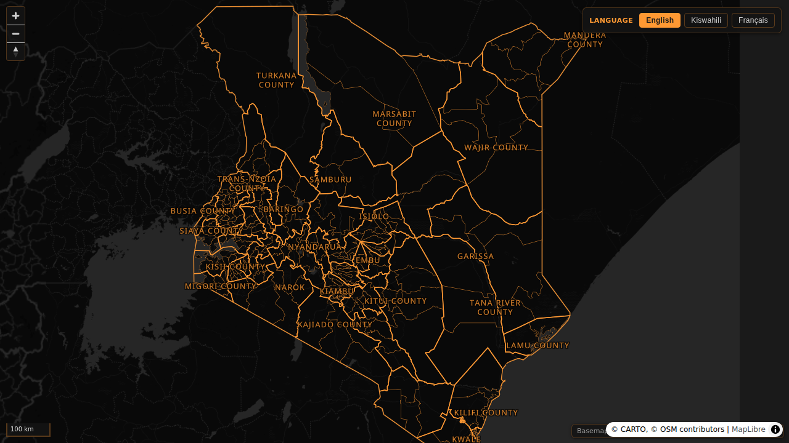

# osm-carto-multilingual

Self-hostable Kenya map with a dark CARTO raster basemap and a multilingual (English / Swahili / French) administrative label overlay (counties, sub-counties, wards) built entirely from OpenStreetMap + Wikidata data — no Mapbox or paid tile APIs.

Live demo: **https://kenya.proto.theflywheel.in/**



---

## How it works

| Piece | What it is |
|---|---|
| **Basemap** | CARTO `dark_nolabels` raster tiles (free, attribution-only), cached locally for the Kenya bbox at z4–z10 (~5 MB). For z11–z13 MapLibre overzooms the z10 tile. |
| **Admin polygons** | Three OSM `admin_level`s fetched via the Overpass API: `4` (47 counties), `6` (291 sub-counties), `8` (969 wards out of an official 1,450). Emitted as one GeoJSON with both boundary LineStrings and label Points. |
| **Multilingual labels** | Two-pass enrichment: (1) batch-fetch labels from Wikidata for OSM features carrying a `wikidata` tag; (2) match remaining features by name + proximity against a SPARQL dump of Kenyan admin entities. For the long tail (mostly wards), a mechanical formula fills in: `Kata ya {X}` (sw), `Quartier de {X}` (fr). >95% coverage per level per language. |
| **Renderer** | MapLibre GL JS. The label `text-field` is a `coalesce(name:<lang>, name:en, name)` expression; the language switcher rewrites it at runtime via `setLayoutProperty`. |
| **Glyphs** | Hosted by Protomaps — openmaptiles.org's CDN returns HTML at the moment. |
| **Theme** | Dark background + saffron `#FF9933` outlines, modeled after [kaun-city/kaun](https://github.com/kaun-city/kaun). |

---

## Quick start (Docker)

```bash
git clone git@github.com:ChakshuGautam/osm-carto-multilingual.git
cd osm-carto-multilingual
docker compose up --build
```

First build takes ~3 minutes because it pulls all the data + tiles fresh inside the image. After that, browse to **http://localhost:8080/**.

The image is fully self-contained (~75 MB) — once built you can `docker save` and ship it anywhere.

---

## Quick start (local dev)

```bash
npm install
npm run bootstrap     # ~3 min: Overpass + Wikidata + 1,126 CARTO tiles
npm run dev           # vite at http://127.0.0.1:5173/
```

Subcommands (in case you want to re-run individual stages):

| Command | What it does |
|---|---|
| `npm run fetch:admin` | Overpass → `data/kenya_admin.geojson` (admin_level 4/6/8) |
| `npm run enrich:wikidata` | Adds `name:en/sw/fr` from Wikidata (cached in `data/wikidata_cache.json`) |
| `npm run fill:translations` | Mechanical formula filler for the long tail |
| `npm run fetch:tiles` | Downloads CARTO `dark_nolabels` tiles for the Kenya bbox to `tiles/cache/` (resumable) |
| `npm run build` | `vite build` → `frontend/dist/` |
| `npm test` | Playwright suite against `BASE_URL` (default: the live URL; override with `BASE_URL=http://localhost:8080 npm test`) |

---

## Adapting to a different country

Two files need edits:

1. **`scripts/fetch_admin.mjs`** — change the country area (`area["ISO3166-1"="KE"]`) and the `LEVELS` array if your country uses different `admin_level` conventions. (Check the [OSM tagging wiki](https://wiki.openstreetmap.org/wiki/Tag:boundary%3Dadministrative) for your country's convention.)
2. **`scripts/fetch_tiles.mjs`** — update `BBOX` to your country's bounding box.

Then update the frontend defaults in `frontend/src/main.js` (`KENYA_CENTER`, `KENYA_BOUNDS`, `maxBounds`) and re-run `npm run bootstrap`.

The Wikidata enrichment query is also Kenya-specific (`wdt:P17 wd:Q114` — country = Kenya). Change `Q114` to your country's Q-id (`Q1033` = Nigeria, `Q252` = Indonesia, etc.).

For the mechanical filler in `scripts/fill_translations.mjs`, the formula templates are hard-coded for Kenyan units in Swahili and French. Replace them with the right templates for your target languages — or remove the script entirely and rely on Wikidata only.

---

## Deploying to your own server (nginx + Let's Encrypt)

The way this is currently deployed:

```bash
# 1. Build locally and rsync to the server (or do this on the server directly).
npm run bootstrap
npm run build
rsync -a --delete frontend/dist/ /var/www/your-domain/

# 2. Symlink the tile cache and admin data into the docroot.
ln -sfn $PWD/tiles/cache /var/www/your-domain/tiles
mkdir -p /var/www/your-domain/data
ln -sfn $PWD/data/kenya_admin.geojson /var/www/your-domain/data/kenya_admin.geojson

# 3. nginx server block — see docker/nginx.conf for the location/gzip directives.
#    Add SSL via certbot:
certbot --nginx -d your-domain
```

The `docker/nginx.conf` in this repo is a drop-in starting point for the location blocks (`/`, `/tiles/`, `/data/`) and gzip config; just wrap it in a `server { server_name your-domain; ... }` block and add the Let's Encrypt directives certbot generates.

---

## Embedding

### Simplest: iframe the live demo

```html
<iframe
  src="https://kenya.proto.theflywheel.in/"
  style="width:100%; height:600px; border:0; border-radius:8px"
  loading="lazy"
  allow="fullscreen"
></iframe>
```

The map will respect the iframe's width/height. The language switcher and zoom controls render inside the frame. There are no auth or CORS gates.

### Embed your own self-hosted instance

Same iframe, but point `src` at your deployment (`http://localhost:8080/` for the Docker container, or `https://your-domain/` for a server deploy).

### Reuse the data with your own MapLibre setup

The GeoJSON and tile URLs are useful on their own — you can drop them into any MapLibre or Leaflet map:

```js
import maplibregl from 'maplibre-gl';

const map = new maplibregl.Map({
  container: 'map',
  style: {
    version: 8,
    glyphs: 'https://protomaps.github.io/basemaps-assets/fonts/{fontstack}/{range}.pbf',
    sources: {
      basemap: {
        type: 'raster',
        tiles: ['https://kenya.proto.theflywheel.in/tiles/{z}/{x}/{y}.png'],
        tileSize: 256, minzoom: 4, maxzoom: 10,
        attribution: '© CARTO, © OSM contributors',
      },
      admin: {
        type: 'geojson',
        data: 'https://kenya.proto.theflywheel.in/data/kenya_admin.geojson',
      },
    },
    layers: [
      { id: 'bg', type: 'background', paint: { 'background-color': '#1a1a1a' } },
      { id: 'basemap', type: 'raster', source: 'basemap' },
      {
        id: 'county', type: 'line', source: 'admin',
        filter: ['all', ['==', ['get', 'admin_level'], 4], ['==', ['get', 'kind'], 'boundary']],
        paint: { 'line-color': '#FF9933', 'line-width': 2 },
      },
      {
        id: 'county-label', type: 'symbol', source: 'admin',
        filter: ['all', ['==', ['get', 'admin_level'], 4], ['==', ['get', 'kind'], 'label']],
        layout: {
          'text-field': ['coalesce', ['get', 'name:sw'], ['get', 'name:en'], ['get', 'name']],
          'text-font': ['Noto Sans Regular'],
          'text-size': 14,
        },
        paint: { 'text-color': '#FF9933', 'text-halo-color': '#000', 'text-halo-width': 1.4 },
      },
    ],
  },
  center: [37.9, 0.2], zoom: 5.5,
});
```

Swap `name:sw` for `name:en` or `name:fr` to switch language. Tile and data CORS are open (`Access-Control-Allow-Origin: *`).

### GeoJSON property reference

Each feature has `kind` ∈ {`boundary`, `label`} and `admin_level` ∈ {`4`, `6`, `8`}.

```json
{
  "type": "Feature",
  "geometry": { "type": "Point", "coordinates": [34.76, -0.68] },
  "properties": {
    "osm_id": "r3338140",
    "admin_level": 4,
    "kind": "label",
    "border_type": "county",
    "name": "Kisii",
    "name:en": "Kisii County",
    "name:sw": "Kaunti ya Kisii",
    "name:fr": "Comté de Kisii",
    "wikidata": "Q3338140"
  }
}
```

---

## Tests

Playwright smoke tests covering page load, label rendering, language switcher, GeoJSON shape, and tile/data endpoints.

```bash
# Test the live deployment
npm test

# Test your local container
BASE_URL=http://localhost:8080 npm test
```

Screenshots land in `screenshots/`, HTML report in `playwright-report/`.

---

## Repository layout

```
osm-carto-multilingual/
├── frontend/
│   ├── index.html
│   └── src/
│       ├── main.js              # MapLibre setup + saffron theme + language switcher
│       └── style.css
├── scripts/
│   ├── fetch_admin.mjs          # Overpass → admin polygons (L4/L6/L8)
│   ├── enrich_wikidata.mjs      # Wikidata multilingual labels (2-pass)
│   ├── fill_translations.mjs    # Formula filler for the long tail
│   └── fetch_tiles.mjs          # CARTO dark_nolabels tile cache (resumable)
├── tests/
│   ├── playwright.config.js
│   ├── map.spec.js              # main suite
│   └── diagnostic.spec.js       # progressive-frame capture, useful when debugging
├── docker/
│   └── nginx.conf
├── Dockerfile                    # multi-stage: bootstrap + build + nginx
├── docker-compose.yml
├── vite.config.js                # serves /tiles/ + /data/ via dev middleware
├── package.json
└── README.md
```

The `tiles/cache/`, `data/`, and `node_modules/` directories are generated and gitignored.

---

## Attribution

- Basemap © [CARTO](https://carto.com/attributions)
- Map data © [OpenStreetMap](https://www.openstreetmap.org/copyright) contributors
- Multilingual labels: [Wikidata](https://www.wikidata.org/) under CC0
- Theme inspired by [kaun-city/kaun](https://github.com/kaun-city/kaun)

## License

MIT.
